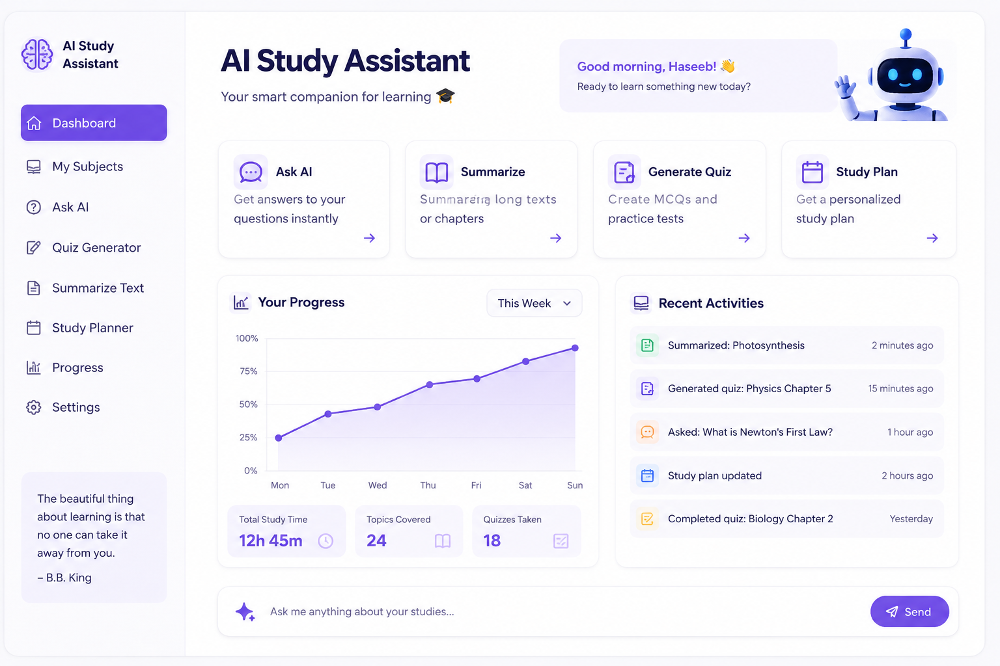

# AI Study Assistant

**Building AI course project**

## Summary

AI Study Assistant is an AI-powered application designed to help students study more effectively. It can answer academic questions, summarize chapters, generate quizzes and practice MCQs, and create personalized study plans. The goal is to make learning easier, faster, and more engaging for students preparing for exams.

## Background

Many students find it difficult to manage their study time and understand complex topics. They often spend hours searching for explanations and creating notes. This project aims to solve these problems by providing an AI assistant that supports learning and exam preparation.

Problems addressed:
* Difficulty understanding complex subjects.
* Lack of personalized study plans.
* Time-consuming note-taking.
* Limited access to instant academic help.

## How is it used?

Students simply enter a question or upload study material. The AI analyzes the input and provides explanations, summaries, quizzes, or study plans based on the student's needs.

Typical users:
* High school students
* College and university students
* Self-learners
* Teachers preparing learning material

## Data Sources and AI Methods

This project uses:
* Educational textbooks and study materials.
* Large Language Models (LLMs) for question answering and summarization.
* Natural Language Processing (NLP) techniques.
* Machine Learning for personalized recommendations.

## Challenges

This project cannot:
* Replace teachers completely.
* Guarantee 100% correct answers every time.
* Work well without quality learning material.
* Understand every subject perfectly.

## What next?

Future improvements include:
* Voice-based learning assistant.
* Mobile application.
* Multi-language support.
* Progress tracking dashboard.
* AI-powered flashcard generator.

## Technologies Used

* Python
* OpenAI API
* GitHub
* Markdown

## Images

Replace `project_image.png` with your own screenshot or image uploaded to your GitHub repository.

## Author

**Haseeb Khan**

## License

This project is created for educational purposes as part of the **Elements of AI – Building AI** course.
